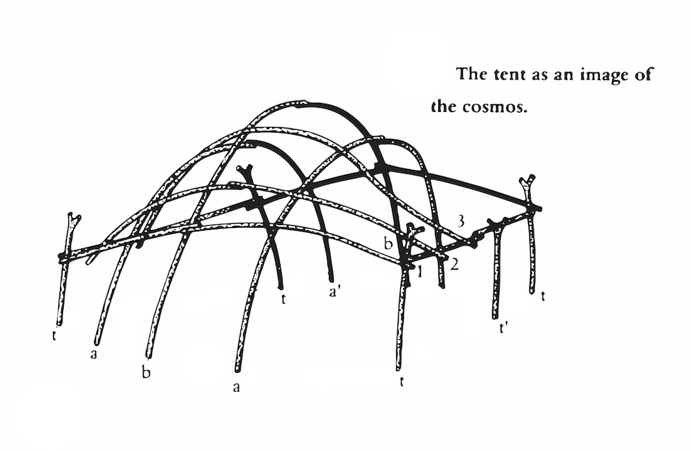

# Black Athena Collective Reading Room
 
 

 
 
The deployment of the tent structure continues our interest in non-western representations of place and forms of architecture. The tent and the architectural notion encoded within it resonates with inflections of mobility and affirm not stability but uncertainty. We draw on nomadic architecture and the form of the tent as a spatial proposition that pushes against dominant framings of place - their histories and historical framings.
